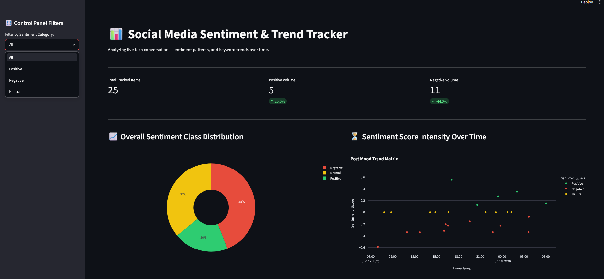
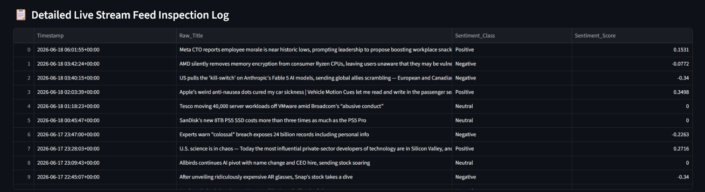

📱 Social Media Sentiment & Trend Tracker
📌 Project Overview

The Social Media Sentiment & Trend Tracker is an end-to-end NLP and data analytics project that collects live text data from public RSS feeds, processes unstructured content, performs real-time sentiment analysis, and presents interactive visualizations through a Streamlit dashboard.

The project demonstrates practical applications of Natural Language Processing (NLP), data engineering, and interactive analytics, enabling users to monitor public sentiment and identify trending topics from continuously updated news and social media content.

🎯 Business Objective

Organizations rely on public opinion to understand customer preferences, monitor brand reputation, and identify emerging trends. This project aims to transform large volumes of unstructured text into meaningful insights by automatically collecting, analyzing, and visualizing sentiment data.

Objective

How can live textual data be analyzed using Natural Language Processing to identify sentiment trends, discover frequently discussed topics, and support data-driven decision-making?

🚀 Features
📡 Automated live RSS feed data collection
🧹 Text preprocessing and data cleaning
😀 Real-time sentiment classification
🔍 Keyword-based article search
📊 Interactive visual analytics dashboard
📈 Trend monitoring and sentiment distribution
⚡ Fast performance using Streamlit caching

🛠️ Tech Stack
Technology	Purpose
Python	Backend Development
Streamlit	Interactive Web Application
Pandas	Data Processing
NLTK	Natural Language Processing
VADER Sentiment Analyzer	Sentiment Classification
Regular Expressions (re)	Text Cleaning
feedparser	RSS Feed Collection
Plotly Express	Interactive Data Visualization

🔄 Project Workflow
Collect live news and RSS feed data.
Clean and preprocess text using Regular Expressions and NLTK.
Remove stop words, punctuation, URLs, emojis, and unnecessary characters.
Perform sentiment analysis using the VADER sentiment lexicon.
Classify content as Positive, Neutral, or Negative.
Generate interactive visualizations with Plotly.
Display insights through a responsive Streamlit dashboard.
📊 Dashboard Features

The dashboard provides:

📈 Sentiment Distribution
📉 Daily Sentiment Trends
🔥 Trending Keywords
🔍 Keyword Search
📰 Latest Articles
😀 Positive, Neutral, and Negative Sentiment Analysis
📊 Interactive Charts
⚡ Cached Data for Improved Performance

💡 Key Capabilities
Automated RSS feed ingestion
Robust text preprocessing pipeline
NLP-based sentiment analysis
Real-time trend identification
Interactive dashboard with filtering and search
Efficient handling of continuously updated text streams
📈 Expected Business Impact

This solution helps organizations:
Monitor public opinion in real time
Track brand sentiment
Detect emerging topics and trends
Support marketing and communication strategies
Improve decision-making through sentiment analytics
